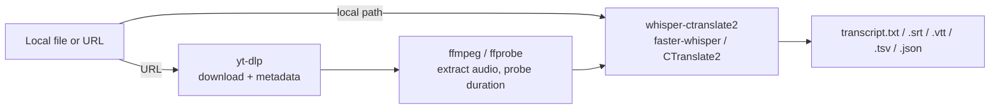

<picture>
  <source media="(prefers-color-scheme: dark)" srcset="assets/banner-dark.svg">
  <source media="(prefers-color-scheme: light)" srcset="assets/banner-light.svg">
  
</picture>

<p>
  <a href="LICENSE"></a>
  
  
  
</p>

Transcribe a local file, or download video/audio/transcripts from YouTube,
Vimeo and ~1800 other sites — all with one small script and a local Whisper
model. No API keys, no cloud upload, no subscription.

## Why

Cloud transcription services are fine until you have a private voice note, a
long backlog of interviews, or just don't want your audio leaving your
machine. `grab` wraps three proven local tools — `yt-dlp`, `ffmpeg`, and
`whisper-ctranslate2` (faster-whisper) — behind one consistent CLI, so you get
the same output structure whether the source is a file on disk or a URL.

## Features

- **Local files or URLs, freely mixed** in a single command/batch.
- **~1800 sites** via `yt-dlp` (YouTube, Vimeo, and most video/audio platforms).
- **Video, audio, transcript, original subtitles, thumbnail, metadata** — pick what you need with `-w`.
- **Every Whisper size**, from `tiny` to `large-v3` and the fast `distil-*`/`turbo` variants — auto-downloaded on first use.
- **Transcribe or translate** to English (`--task translate`).
- **5 transcript formats** (`txt`, `srt`, `vtt`, `tsv`, `json`), pick one or get them all.
- **Batch mode**: many files/URLs in one run, one summary at the end.
- Also ships as an installable **Claude Code skill** — see [below](#claude-code-skill).

## Install

```bash
brew install yt-dlp ffmpeg
uv tool install whisper-ctranslate2
```

Then either run the script directly, or install `grab` as a command:

```bash
git clone https://github.com/joseluisalmendral/transcriptor.git
cd transcriptor
uv tool install .          # installs the `grab` command
# or, without cloning:
uv tool install git+https://github.com/joseluisalmendral/transcriptor.git
```

## Usage

```bash
grab "/path/note.ogg"                         # transcribe a local file
grab "https://youtu.be/xxxx"                  # audio only (default for URLs)
grab URL -w video,audio,transcript            # pick several targets at once
grab URL -w all                                # everything
grab "note.ogg" "URL1" "URL2" -w transcript   # local files and URLs, mixed
grab -f targets.txt -w audio                  # paths/URLs from a file
grab "entrevista.mp3" --task translate        # foreign audio -> English text
```

<details>
<summary>More examples</summary>

```bash
# High-quality transcription of a long interview (Spanish, best value model)
grab "URL" -w transcript --whisper-model distil-large-v3 --language es

# Only srt subtitles, skip txt/tsv/json
grab "URL" -w transcript --transcript-format srt

# Only the platform's original captions (no Whisper involved)
grab "URL" -w subs

# Full video in 4K with embedded subs/metadata
grab "URL" -w video --video-quality 2160

# Custom output folder
grab "URL" -w audio -o ~/Music/grabs
```
</details>

### Options

| flag | default | meaning |
|---|---|---|
| `-w, --want` | `audio` (URLs) / `transcript` (local) | `video`, `audio`, `transcript`, `subs`, `thumb`, `info`, `all` |
| `-o, --output` | next to the file (local) / `downloads/` (URLs) | output folder |
| `--whisper-model` | `small` | `tiny` … `large-v3`, `distil-*`, `turbo` — see [docs/models.md](docs/models.md) |
| `--language` | auto-detect | ISO language code |
| `--task` | `transcribe` | `translate` outputs English text |
| `--transcript-format` | `all` | `txt`, `vtt`, `srt`, `tsv`, `json`, `all` |
| `--audio-format` | `mp3` | `m4a`, `opus`, `flac`, `wav`… |
| `--video-quality` | `1080` | max height: `720`, `1080`, `2160`… |

## How it works



Full model comparison (size/speed/languages) and advanced Whisper flags not
wired into the CLI (speaker diarization, live mic dictation, word-level
timestamps): [docs/models.md](docs/models.md).

## Output layout

```
# URLs
downloads/<uploader>/<title> [<id>]/
    video.mp4        audio.mp3
    transcript.{txt,srt,vtt,tsv,json}
    thumbnail.jpg    info.json

# Local file (default: next to the source)
<same folder as source>/
    transcript.{txt,srt,vtt,tsv,json}
```

## Claude Code skill

This repo also ships as a ready-to-use [Claude Code](https://claude.com/claude-code)
skill — invoke it as `/transcriptor` from any project. It picks the right
Whisper model for the situation, checks whether it needs downloading first,
and lists everything it can do on request.

Download the packaged skill from the [latest release](../../releases/latest)
and unzip it into `~/.claude/skills/`, then run the install commands above.

## Contributing

See [CONTRIBUTING.md](CONTRIBUTING.md).

## License

MIT — see [LICENSE](LICENSE). `grab.py` is original code under MIT; it calls
`yt-dlp` (Unlicense), `ffmpeg` (GPL/LGPL) and `whisper-ctranslate2` (MIT) as
separate external processes rather than linking against them, so this
project's license doesn't inherit their terms — you're still bound by each
tool's own license for that tool itself.

## Acknowledgments

- [yt-dlp](https://github.com/yt-dlp/yt-dlp) — media downloader
- [FFmpeg](https://ffmpeg.org/) — audio/video processing
- [faster-whisper](https://github.com/SYSTRAN/faster-whisper) / [whisper-ctranslate2](https://github.com/Softcatala/whisper-ctranslate2) — fast local Whisper inference
- [OpenAI Whisper](https://github.com/openai/whisper) — the underlying speech model
