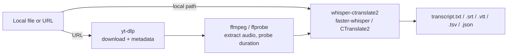

<picture>
  <source media="(prefers-color-scheme: dark)" srcset="assets/banner-dark.svg">
  <source media="(prefers-color-scheme: light)" srcset="assets/banner-light.svg">
  
</picture>

<br>
<br>
<br>

<p>
  <a href="LICENSE"></a>
  
  
  
</p>

Transcribe a local file, or download video/audio/transcripts from YouTube,
Vimeo and ~1800 other sites — all with one small script and a local Whisper
model. No API keys, no cloud upload, no subscription.

---

## Use it with an AI agent

`offscript` gets you the text. Your agent does the rest — summarise the meeting,
pull out the action items, draft the reply. That is the whole point: the hard
part (accurate speech-to-text, locally) stops being the bottleneck.

**Paste this into Claude Code, Cursor, or any coding agent.** It picks up
everything it needs from [`AGENTS.md`](AGENTS.md) — how to check the machine
before touching it, which model fits the job, and what to do when something is
missing:

```text
Read https://raw.githubusercontent.com/joseluisalmendral/offscript/main/AGENTS.md
and follow it.

Set up offscript on this machine, then transcribe ~/Downloads/recording.m4a —
it's in Spanish.

Check what's already installed before installing anything, and tell me the
download size before you commit me to a model.
```

### Everyday things to ask for

Once it is set up, you talk to your agent normally. No flags to remember:

| You say | What you get |
|---|---|
| *"This voice note is 9 minutes and I don't want to listen to it again — transcribe it and tell me the 3 things I need to reply to."* | The transcript, then the answer. Your agent reads it so you don't have to. |
| *"Get me SRT subtitles for this talk so I can publish it with captions: `<url>`"* | Downloads the audio, transcribes with a high-accuracy model, writes `transcript.srt`. |
| *"Transcribe yesterday's team call and pull out who committed to what, with timestamps."* | A 50-minute meeting becomes a list of owners and deadlines. |
| *"The interview is in Portuguese. I need it as English text I can paste into a doc."* | One flag away — Whisper translates as it transcribes. |
| *"Transcribe every voice memo in `~/Recordings`."* | Batch run, one transcript per file, one summary at the end. |
| *"Which Whisper models am I storing and how much disk are they eating?"* | Sizes listed, then it offers to delete the ones you won't reuse. |
| *"Just get me the transcript of this YouTube video — don't download any huge models."* | Uses the platform's own captions instead. No model, no gigabytes. |

### Why it behaves well in an agent's hands

Most CLI tools fail halfway through and leave the agent guessing. This one is
built to be driven:

- **It says what it can do before it tries.** `offscript --doctor` reports tools,
  cached models with sizes, network reach and free disk, and exits `0` ready /
  `1` install-needed / `2` blocked — so an agent routes on a number, not on
  parsing prose.
- **It asks before spending your resources.** Downloads over 1GB and model
  deletions are surfaced to you, not decided quietly.
- **Its errors point at the real cause.** A file that isn't there says so,
  instead of being handed to the downloader and coming back as
  `is not a valid URL`.

---

## Why

Cloud transcription services are fine until you have a private voice note, a
long backlog of interviews, or just don't want your audio leaving your
machine. `offscript` wraps three proven local tools — `yt-dlp`, `ffmpeg`, and
`whisper-ctranslate2` (faster-whisper) — behind one consistent CLI, so you get
the same output structure whether the source is a file on disk or a URL.

## Features

- **Local files or URLs, freely mixed** in a single command/batch.
- **~1800 sites** via `yt-dlp` (YouTube, Vimeo, and most video/audio platforms).
- **Video, audio, transcript, original subtitles, thumbnail, metadata** — pick what you need with `-w`.
- **Every Whisper size**, from `tiny` to `large-v3` plus the fast `turbo`/`distil-*` variants — auto-downloaded on first use, and it refuses to run an English-only model on other-language audio.
- **Transcribe or translate** to English (`--task translate`).
- **5 transcript formats** (`txt`, `srt`, `vtt`, `tsv`, `json`), pick one or get them all.
- **Batch mode**: many files/URLs in one run, one summary at the end.
- **`--doctor`**: tells you up front what this machine can actually do — tools, cached models, network, disk — instead of failing halfway.
- **Works offline** (`--offline`) against an already-cached model, and **frees disk** on demand (`--purge-model`).
- **Agent-ready**: machine-readable preflight exit codes plus [`AGENTS.md`](AGENTS.md), and it ships as an installable **Claude Code skill** — see [below](#claude-code-skill).

## Install

```bash
brew install yt-dlp ffmpeg
uv tool install whisper-ctranslate2
```

Then either run the script directly, or install `offscript` as a command:

```bash
git clone https://github.com/joseluisalmendral/offscript.git
cd offscript
uv tool install .          # installs the `offscript` command
# or, without cloning:
uv tool install git+https://github.com/joseluisalmendral/offscript.git
```

## Usage

```bash
offscript --doctor                                 # what can this machine do? (run this first)
offscript "/path/note.ogg"                         # transcribe a local file
offscript "https://youtu.be/xxxx"                  # audio only (default for URLs)
offscript URL -w video,audio,transcript            # pick several targets at once
offscript URL -w all                                # everything
offscript "note.ogg" "URL1" "URL2" -w transcript   # local files and URLs, mixed
offscript -f targets.txt -w audio                  # paths/URLs from a file
offscript "entrevista.mp3" --task translate        # foreign audio -> English text
```

`--doctor` reports installed tools, which Whisper models are already cached
(with sizes), whether Hugging Face and PyPI are reachable, free disk, and which
of the three capabilities — transcribe a local file, download from a URL, fetch
captions only — actually work here. It exits `0` ready / `1` install-needed /
`2` blocked, so it's usable in scripts and by agents.

<details>
<summary>More examples</summary>

```bash
# High-quality transcription of a long interview (Spanish, best value model)
offscript "URL" -w transcript --whisper-model large-v3-turbo --language es

# Only srt subtitles, skip txt/tsv/json
offscript "URL" -w transcript --transcript-format srt

# Only the platform's original captions (no Whisper involved)
offscript "URL" -w subs

# Full video in 4K with embedded subs/metadata
offscript "URL" -w video --video-quality 2160

# Custom output folder
offscript "URL" -w audio -o ~/Music/transcripts

# Offline: use an already-cached model, never touch the network
offscript "note.ogg" --whisper-model medium --offline

# Free disk: delete one cached model (refuses ambiguous names)
offscript --purge-model large-v3-turbo

# Captions only — no Whisper model, no multi-GB download
offscript "URL" -w subs
```
</details>

### Options

| flag | default | meaning |
|---|---|---|
| `-w, --want` | `audio` (URLs) / `transcript` (local) | `video`, `audio`, `transcript`, `subs`, `thumb`, `info`, `all` |
| `-o, --output` | next to the file (local) / `downloads/` (URLs) | output folder |
| `--whisper-model` | `small` | `tiny` … `large-v3`, `distil-*`, `turbo` — see [docs/models.md](docs/models.md) |
| `--language` | auto-detect | ISO language code |
| `--task` | `transcribe` | `translate` outputs English text |
| `--transcript-format` | `all` | `txt`, `vtt`, `srt`, `tsv`, `json`, `all` |
| `--audio-format` | `mp3` | `m4a`, `opus`, `flac`, `wav`… |
| `--video-quality` | `1080` | max height: `720`, `1080`, `2160`… |
| `--offline` | off | require a cached model, never reach the network |
| `--doctor` | — | report tools/models/network/disk, then exit |
| `--purge-model` | — | delete one cached model to free disk, then exit |

## How it works



Full model comparison (size/speed/languages) and advanced Whisper flags not
wired into the CLI (speaker diarization, live mic dictation, word-level
timestamps): [docs/models.md](docs/models.md).

## Output layout

```
# URLs
downloads/<uploader>/<title> [<id>]/
    video.mp4        audio.mp3
    transcript.{txt,srt,vtt,tsv,json}
    thumbnail.jpg    info.json

# Local file (default: next to the source)
<same folder as source>/
    transcript.{txt,srt,vtt,tsv,json}
```

## Model cache & disk

Models are downloaded once and kept in `~/.cache/huggingface/hub/` forever
until something deletes them — `large-v3` alone is ~3GB, so a few large models
add up to several silent gigabytes. `offscript --doctor` lists what's cached with
sizes; `offscript --purge-model <name>` removes one and reports how much it freed.

Purging resolves the name against the real model→repo map (a substring guess
is wrong here: `distil-large-v3` lives in `faster-distil-whisper-large-v3`),
refuses ambiguous or unknown names, and verifies the resolved path sits inside
the Hugging Face cache before deleting anything.

## Claude Code skill

This repo also ships as a ready-to-use [Claude Code](https://claude.com/claude-code)
skill — invoke it as `/offscript` from any project. It runs `--doctor` as a
preflight before its first attempt, so a restricted environment (a sandbox with
no network, or a machine missing the tools) is reported immediately with the
exact command to run elsewhere, instead of failing halfway through. It also
picks the model to fit the job, asks before downloading multiple gigabytes or
deleting anything, and lists everything it can do on request.

Download the packaged skill from the [latest release](../../releases/latest)
and unzip it into `~/.claude/skills/`, then run the install commands above.

## Contributing

See [CONTRIBUTING.md](CONTRIBUTING.md).

## License

MIT — see [LICENSE](LICENSE). `offscript.py` is original code under MIT; it calls
`yt-dlp` (Unlicense), `ffmpeg` (GPL/LGPL) and `whisper-ctranslate2` (MIT) as
separate external processes rather than linking against them, so this
project's license doesn't inherit their terms — you're still bound by each
tool's own license for that tool itself.

## Acknowledgments

- [yt-dlp](https://github.com/yt-dlp/yt-dlp) — media downloader
- [FFmpeg](https://ffmpeg.org/) — audio/video processing
- [faster-whisper](https://github.com/SYSTRAN/faster-whisper) / [whisper-ctranslate2](https://github.com/Softcatala/whisper-ctranslate2) — fast local Whisper inference
- [OpenAI Whisper](https://github.com/openai/whisper) — the underlying speech model
