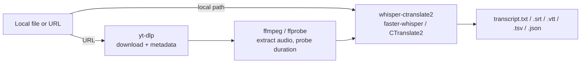

# Whisper models

`grab` runs models through `whisper-ctranslate2` (a CLI over `faster-whisper`,
which runs OpenAI's Whisper weights on the CTranslate2 inference engine).
Sizes below are approximate (int8 quantization, the default). Any model
downloads automatically on first use and is cached in
`~/.cache/huggingface/hub/` for later runs — no manual setup needed.

| Model | Download | Speed | Multilingual | Best for |
|---|---|---|---|---|
| `tiny` / `tiny.en` | ~75MB | fastest | yes / EN only | throwaway drafts |
| `base` / `base.en` | ~145MB | very fast | yes / EN only | quick drafts, a bit more accurate |
| `small` | ~484MB | fast | yes | short/clean audio, good general default |
| `medium` | ~1.5GB | medium | yes | podcasts/interviews, solid accuracy/speed balance |
| `distil-large-v3` / `v3.5` | ~1.5GB | ~4-6x faster than large-v3 | yes | **best value** — near large-v3 accuracy at a fraction of the time |
| `large-v3-turbo` / `turbo` | ~1.6GB | ~8x faster than large-v3 | yes | very fast, marginally less accurate than distil-large-v3 |
| `large-v1` / `v2` / `v3` | ~2.9-3.1GB | slow | yes | maximum accuracy — tough accents, noisy audio |
| `distil-medium.en` | ~750MB | fast | EN only | fast English-only transcription |
| `distil-small.en` | ~330MB | fastest | EN only | fastest English-only drafts |

Rules of thumb:
- Never use a `.en` variant for non-English audio.
- Undecided between `medium` (smaller, likely already cached) and
  `distil-large-v3` (better, bigger download): use `medium` for short clips,
  `distil-large-v3` when accuracy matters or the file is long.
- Instrumental passages in music can transcribe to empty text, or hallucinate
  lyrics — expected Whisper behavior, not a bug.

## Advanced flags (not wired into `grab.py`)

`grab.py` exposes the flags people actually need day to day. Everything else
in `whisper-ctranslate2` is one command away — run it directly on the audio
`grab` already extracted:

- **Speaker diarization**: `--speaker_name`, `--speaker_num N`, `--hf_token <token>` (requires a Hugging Face token and accepting the gated pyannote model terms). Useful for meetings/interviews with multiple voices.
- **Live microphone dictation**: `--live_transcribe True [--live_input_device N] [--live_volume_threshold X]`.
- **Word-level timestamps for cleaner subtitles**: `--word_timestamps True --max_line_width N --max_line_count N` (or `--max_words_per_line`), plus `--highlight_words True`.
- **Domain vocabulary** (names, jargon): `--hotwords "word1 word2 …"`.
- **Voice activity detection (VAD)**: `--vad_filter True` with `--vad_threshold`, `--vad_min_speech_duration_ms`, etc. — helps with long silences or background noise.
- **English translation**: already wired via `grab.py --task translate`.
- **Throughput**: `--batched True --batch_size N` for large batches; `--device cuda` if a CUDA GPU is available (Apple Silicon runs CPU-only).

## Pipeline

Everything runs locally — nothing is uploaded to a third-party service.
